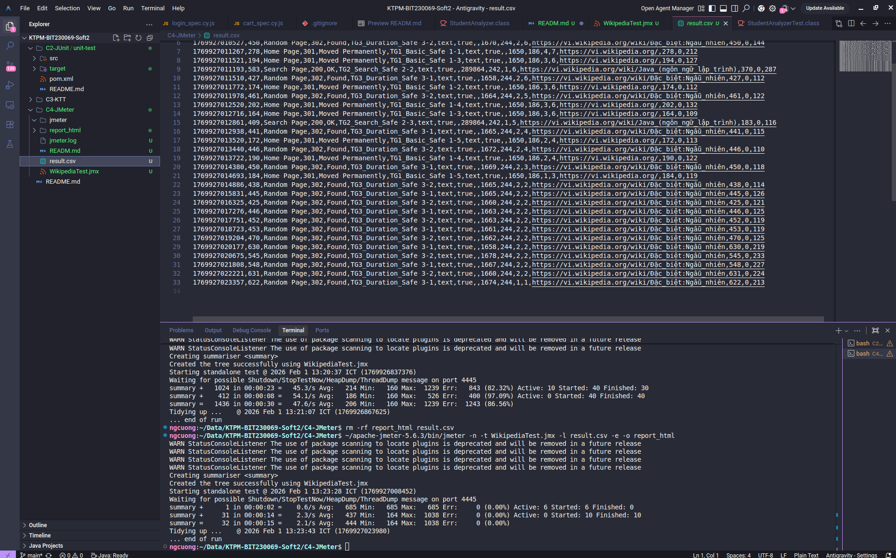
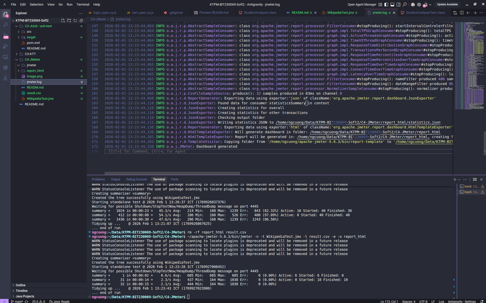

# Báo cáo Kiểm thử Hiệu năng với JMeter

**Website kiểm thử:** https://vi.wikipedia.org
**Công cụ:** Apache JMeter 5.6.3 

## 1. Cấu hình kịch bản (Safe Mode)
Để tuân thủ chính sách Rate Limiting của Wikipedia, kịch bản đã được tối ưu hóa:
* **User Agent:** Giả lập trình duyệt Chrome (Tránh lỗi 403 Forbidden).
* **Constant Timer:** Độ trễ 1 giây giữa các request.

### Các Thread Group:
1.  **TG1 (Trang chủ):** 5 Users, lặp 2 lần.
2.  **TG2 (Tìm kiếm):** 3 Users, lặp 1 lần.
3.  **TG3 (Ngẫu nhiên):** 2 Users, chạy bền trong 15 giây.

## 2. Kết quả Kiểm thử
* **Tổng số yêu cầu:** 32
* **Tỷ lệ lỗi (Error Rate):** 0.00% (Thành công tuyệt đối)
* **Thời gian phản hồi trung bình (Avg):** ~444 ms

## 3. File Minh chứng
* **File kịch bản:** [WikipediaTest.jmx](./WikipediaTest.jmx)
* **File kết quả thô:** [result.csv](./result.csv)
* **Báo cáo HTML:** [Xem thư mục report_html](./report_html)
